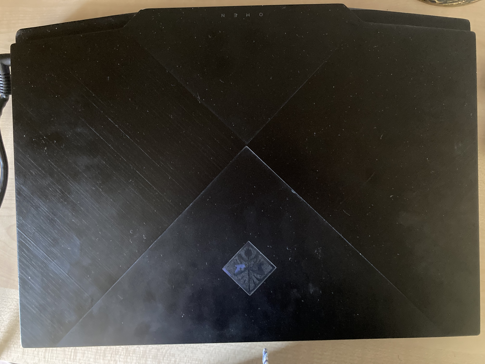

# My computers specs

The product name is OMEN by HP Laptop 15-dh0xxx

The product number is 7DW16EA#A2N

The computers cpu is an Intel core i7-9750h

The computers gpu is a Nvidea GeForce RTX 2060

The computers RAM is 16gb  

There is bluetooth on my computer

There is wifi on my computer

## There are two storage devices on my computer:
* A standered windows storage that holds 237 gb
* A data storage that holds 931 gb

## The ports on my computer are:
* 3 USB A ports
* 1 USB C port
* 1 Mini display port
* 1 SD card slot
* 1 HDMI cable slot
* 1 Headphone jack
* 1 charging port

## How I feel about my computer
I absaloutely **love** this thing, I got it in 2019 in december after my old computer, a 2012 macbook, was litterally falling apart. This thing has stuck with me and is an amazing gaming laptop in general. 

This laptop is more powerful than a lot of gaming pc's are, the main problem though is that gaming pc's are big for a reason, to cool themselves down. This laptop having the power of a gaming PC is means it over heats fast. 

## Here are some pictures of my computer

